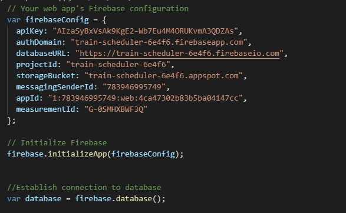

# UC Berkeley Fullstack Coding Bootcamp

# Train-Scheduler

## App Overview:
- A train schedule application that incorporates Firebase to host arrival and departure data.
- The app will retrieve and manipulate this information with Moment.js.
- This website will provide up-to-date information about various trains, namely their arrival times and how many minutes remain until they arrive at their station.

## How it works?
-When adding trains, administrators are able to submit the following:
    - Train Name
    - Destination
    - First Train Time -- in military time
    - Frequency -- in minutes
- App uses data validation for user inputed trains
- App calculates when the next train will arrive relative to the current time
- Train info is stored using FireBase

## Game in action:

## Important code snippit:
This particular code shows the usage of Firebase.

## Currently working with:
- Html
- CSS
- JavaScript
- jQuery
- GitBash
- GitLab
- GitHub
- Timers
- API
- Firebase

## Assignments (works in progress):

- [Profile](https://github.com/Mamitin/Basic-portfolio/blob/master/portfolio.html)
- [Portfolio](https://github.com/Mamitin/Basic-portfolio/blob/master/portfolio.html)
- [Contact](https://github.com/Mamitin/Basic-portfolio/blob/master/contact.html)
- [Wireframe](https://github.com/Mamitin/HW-Wireframe/blob/master/index.html)
- [Bootstrap Portfolio](https://github.com/Mamitin/Bootstrap-Portfolio/blob/master/index.html)
- [Crytal Collector](https://mamitin.github.io/unit-4-game/blob/master/index.html)
- [Simpson Trivia Game](https://github.com/Mamitin/TriviaGame)
- [GifTastic](https://github.com/Mamitin/GifTastic)
- [Train-Scheduler](https://github.com/Mamitin/Train-Scheduler)

## Contributing
Please find me on [Linkedin](https://www.linkedin.com/in/monica-amitin-58635475/).

